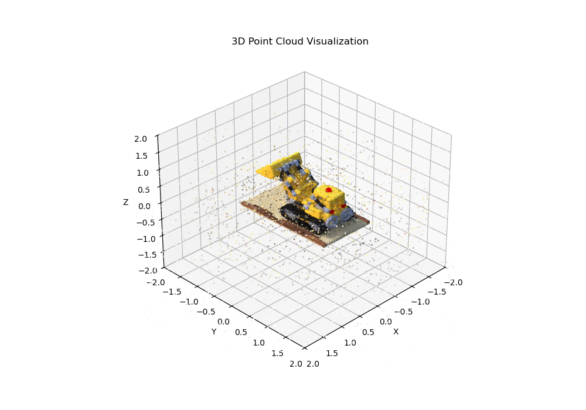
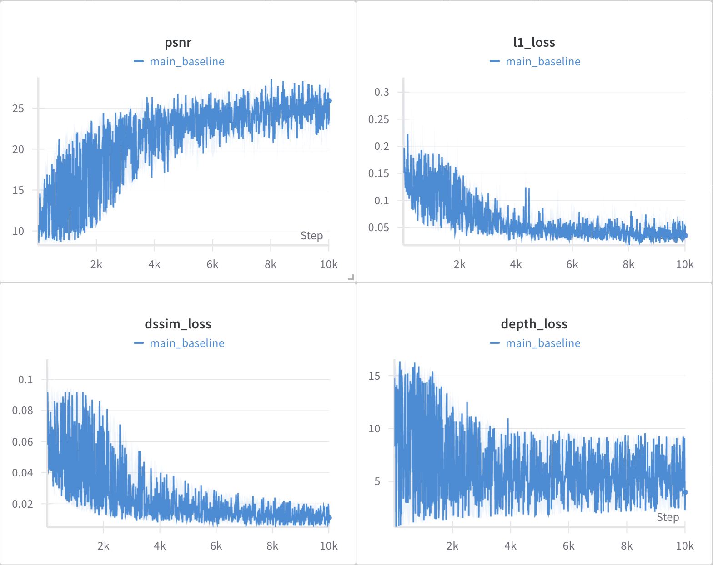
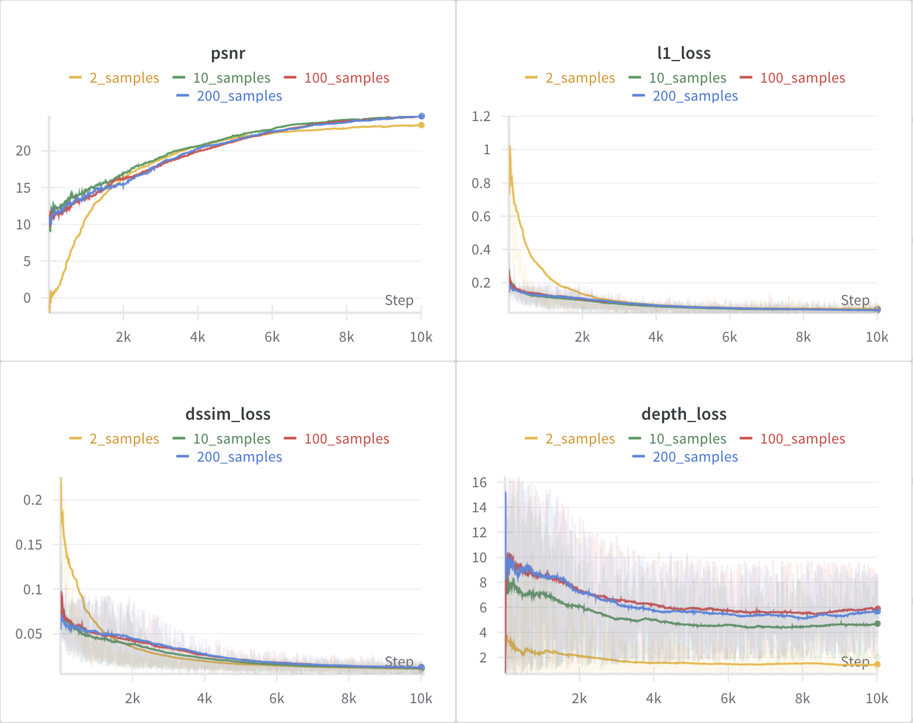

[](https://classroom.github.com/a/yjiC1df2)

[[Homework Description Slides](https://docs.google.com/presentation/d/15rfk9sOBIENCqLzUhFOhG9zRjjB2YrRkb_tgm7wwOB4/edit#slide=id.g28aec11547e_0_46)] [[Youtube Rendering Video Link](https://youtu.be/CG5twLZ9Vi4)]

# EV HW1: 3D Gaussian Splatting

## Setup
To set up the virtual environment and install the required packages, use the following commands:
```bash
conda env create -f environment.yml
conda activate ev_hw1
```

## Data Preparation
To download the dataset, run the command:
```
bash download_data.sh
```

## Training
To train the model, run the command:
```bash
python run.py
```

## Experiments

1. **Point Cloud Results**

    Raw point cloud retrieved from rgb, depth, and alpha images. The `get_point_clouds` function reconstructs 3D points from multiple camera views using depth maps, camera intrinsics/extrinsics, and optional RGB data. It computes world-space ray directions for each pixel, multiplies them by depth values to get 3D coordinates, and filters valid points using an alpha mask.

    <p float="middle">
    
    </p>

2. **Major Baseline training process.**

    The training process is conducted using the default configuration: 200 training images, with loss weights set to 0.8 for L1 loss, 0.4 for DSSIM loss, and 0.0 for depth loss. As expected, the L1 and DSSIM losses converge steadily, indicating effective training. However, since the depth loss is not used, it does not show significant decay. In the resulting video, while object contours are somewhat recognizable, the depth information appears ambiguous and poorly separated from the background.

    <p float="middle">
    
    
    </p>

3. **Different numbers of training data.**

    I also experimented with the sparse sampling setup. All runs used the default configuration—loss weights of 0.8 for L1 loss, 0.4 for DSSIM loss, and 0.0 for depth loss—with only the number of training images varied. The PSNR scores for the 200, 100, and 10-sample runs are quite similar, while the 2-sample run shows a noticeable drop in performance and a higher initial loss. Interestingly, the 3D reconstruction remains visually reasonable even with just 2 samples. However, the depth predictions become less accurate as the number of training views decreases. This makes sense, as having fewer viewpoints provides less information about the scene geometry, making it harder to infer depth accurately—especially in the absence of explicit depth supervision.

    <p float="middle">
    
    </p>

    <p float="middle">
    
    
    
    </p>

4. **Using the depth loss**.

    Lastly, I experimented with including the depth loss, using a configuration of 0.8 for L1 loss, 0.4 for DSSIM loss, and 0.1 for depth loss. Interestingly, while the PSNR score is slightly lower compared to the baseline without depth supervision, the depth loss shows clear signs of optimization, steadily decreasing throughout training. Qualitatively, the RGB 3D reconstructions remain solid, and most importantly, the depth renderings exhibit much clearer object contours, with the foreground distinctly separated from the background—which appears darker, indicating greater depth values. The drop in PSNR performance might be attributed to noisy or inconsistent points outside the main object, which the additional depth supervision attempts to regularize but could also introduce conflicts with the photometric loss in those areas.

    <p float="middle">
    
    
    </p>

## Model Checkpoints and Configurations

1. **`./checkpoints/model_200_samples.pt`**  
   - **Configuration**: 200 training samples  
   - **Loss Weights**: L1 = 0.8, DSSIM = 0.4, Depth = 0.0  
   - **Notes**: Original configuration; good reconstruction; depth not well distinguished due to lack of depth supervision.

2. **`./checkpoints/model_100_samples.pt`**  
   - **Configuration**: 100 training samples  
   - **Loss Weights**: L1 = 0.8, DSSIM = 0.4, Depth = 0.0  
   - **Notes**: Comparable PSNR to 200-sample model; fewer perspectives but maintains reconstruction quality.

3. **`./checkpoints/model_10_samples.pt`**  
   - **Configuration**: 10 training samples  
   - **Loss Weights**: L1 = 0.8, DSSIM = 0.4, Depth = 0.0  
   - **Notes**: Still good reconstruction; less accurate depth prediction due to reduced views.

4. **`./checkpoints/model_2_samples.pt`**  
   - **Configuration**: 2 training samples  
   - **Loss Weights**: L1 = 0.8, DSSIM = 0.4, Depth = 0.0  
   - **Notes**: Higher initial loss; PSNR drops; reconstruction surprisingly solid, but depth is poorly estimated.

5. **`./checkpoints/model_200_samples_depthw_0.1.pt`**  
   - **Configuration**: 200 training samples  
   - **Loss Weights**: L1 = 0.8, DSSIM = 0.4, Depth = 0.1  
   - **Notes**: Depth supervision added; lower PSNR but clearer depth maps with distinct contours and background separation.
