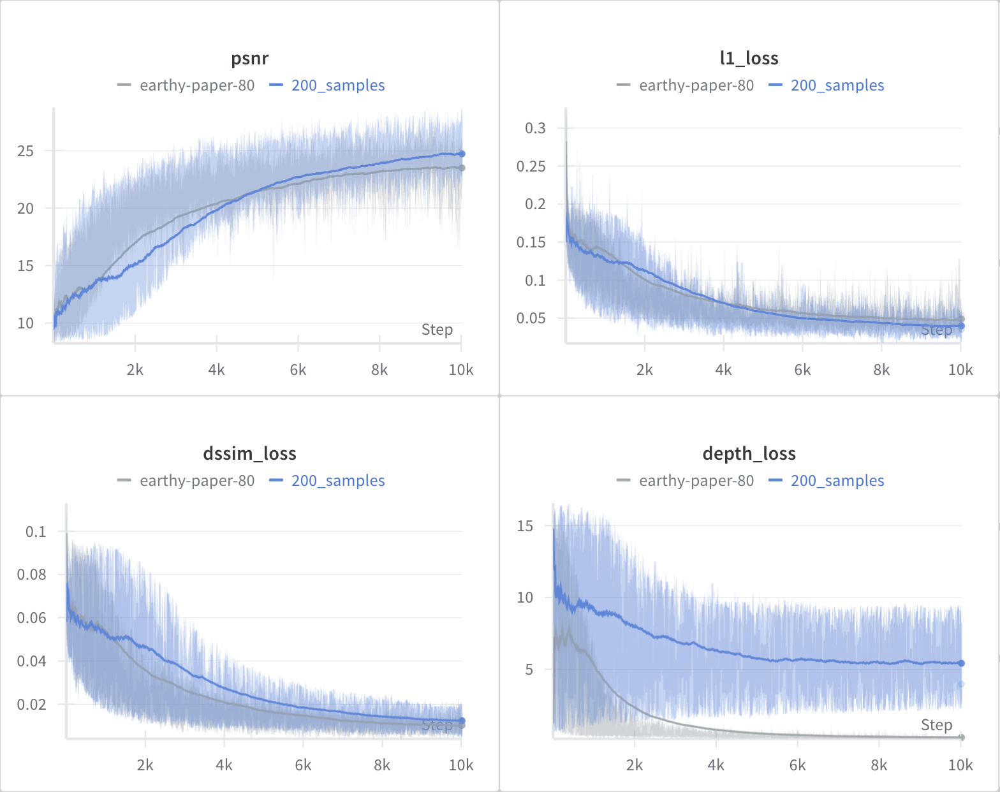

[](https://classroom.github.com/a/yjiC1df2)

[[Homework Description Slides](https://docs.google.com/presentation/d/15rfk9sOBIENCqLzUhFOhG9zRjjB2YrRkb_tgm7wwOB4/edit#slide=id.g28aec11547e_0_46)]

# EV HW1: 3D Gaussian Splatting


## Setup
To set up the virtual environment and install the required packages, use the following commands:
```bash
conda env create -f environment.yml
conda activate ev_hw1
```

## Data Preparation
To download the dataset, run the command:
```
bash download_data.sh
```

## Training
To train the model, run the command:
```bash
python run.py
```

## Experiments

1. Point Cloud Results


2. Major Baseline training process.


3. Different numbers of training data.


4. Using the depth loss.
